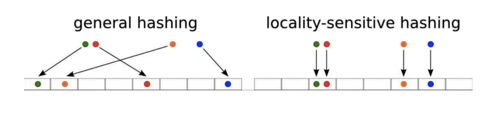

# Locality Sensitive Hashing
* Large scale similarity matching.
* used in recommendation and search.

# Smiliar Article (Toy Case)

d1 : “Who was the first king of Poland”

d2 : “Who was the first ruler of Poland”

d3 : “Egypt”

id|who|was|the|first|king|ruler|of|poland|egypt
--|---|---|--|------|----|-----|--|------|-----
1 | 1 | 1 | 1|  1   |  1|   0  | 1|   1  |   0|
2 | 1 | 1 | 1|  1   |  0|   1  | 1|   1  |   0|
1 | 0 | 0 | 0|  0   |  0|   0  | 0|   0  |   1|

suppose we have $N$ docuemnts.

find similar documents by similarity function

time complexity : $O(N^2)$
space complexity : $O(1)$

# time compleixty --> space compleixty ?

Yes! hashing!

</img>

[ref](https://towardsdatascience.com/understanding-locality-sensitive-hashing-49f6d1f6134)

the mathematician do the work.

the magic hash function - hash similar document to the same bucket **approximately**.

suppose we have $N$ docuemnts, $D$ features, $K$ hash buckets.

time complexity : $O(N)$

space complexity : 

1. hash functions : $O(DK)$
2. hashes : $O(K)$

# Demo

* switch to notebook.

# Libraries

1. [NearPy, 700+ stars](https://github.com/pixelogik/NearPy)
   1. redis.
   2. well designed orm.
   3. cosine, L1, L2

2. [datasketch: Big Data Looks Small, 1.8k+ stars](https://github.com/ekzhu/datasketch)
   1. redis
   2. jaccard.

3. finding similar stuff in large scale - an active research area
   1. [benchmark for libraries, stars 3k+](https://github.com/erikbern/ann-benchmarks)
      1. Annoy --> Spotfiy
      2. FAISS --> Facebook
      3. ScaNN --> Google

keyword : `locality sensitive hashing`, `lsh` `approximately nearest neighbor`, `ann`